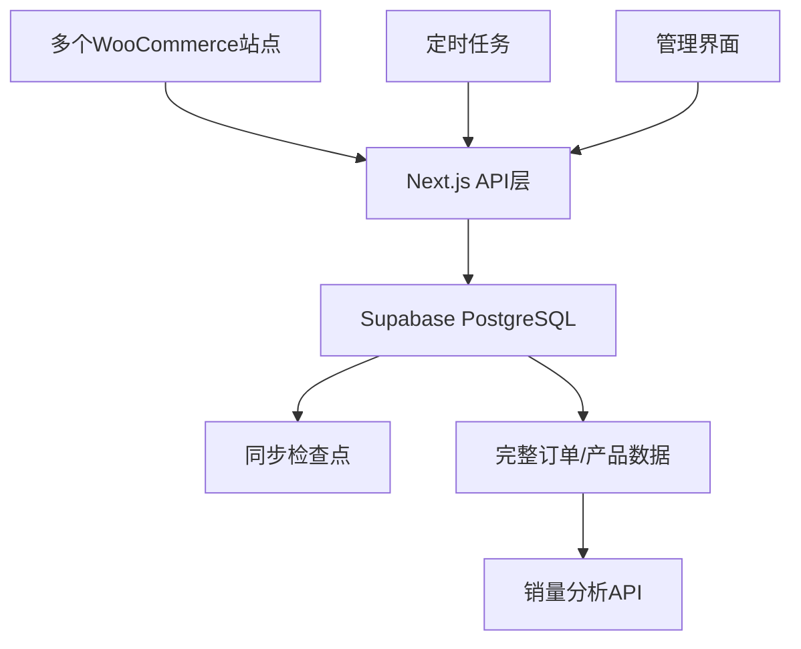

# 多站点WooCommerce数据同步系统部署指南

## 概述

这是一个完整的多站点WooCommerce数据同步解决方案，支持：

- 📦 完整的订单和产品数据存储
- 🔄 增量同步机制，仅同步变更数据
- ⚡ 基于本地数据库的快速销量查询
- 🏢 多站点数据聚合分析
- 🔧 自动化定时同步任务
- 📊 详细的同步监控和日志

## 系统架构



## 部署步骤

### 1. Supabase数据库设置

1. 创建新的Supabase项目
2. 在SQL编辑器中执行以下脚本：
   ```sql
   -- 执行 supabase/schema-v2.sql 文件中的完整脚本
   ```

3. 获取项目配置：
   - `NEXT_PUBLIC_SUPABASE_URL`: 项目URL
   - `NEXT_PUBLIC_SUPABASE_ANON_KEY`: 匿名密钥

### 2. 环境变量配置

复制 `.env.example` 为 `.env` 并配置：

```bash
# Supabase配置（必需）
NEXT_PUBLIC_SUPABASE_URL=your_supabase_project_url
NEXT_PUBLIC_SUPABASE_ANON_KEY=your_supabase_anon_key

# 定时同步安全密钥
SYNC_CRON_SECRET=your-secure-random-key

# 定时同步频率（每6小时）
SYNC_CRON_SCHEDULE="0 */6 * * *"
```

### 3. 安装依赖

```bash
npm install
```

### 4. 构建和启动

```bash
# 开发模式
npm run dev

# 生产模式
npm run build
npm run start
```

### 5. 配置WooCommerce站点

1. 访问 `/sites` 页面
2. 添加各个WooCommerce站点的API配置
3. 测试连接确保配置正确

### 6. 执行初始数据同步

在站点管理页面中，为每个站点点击"初始数据同步"按钮，这将：

- 同步所有历史订单数据
- 同步所有产品和变体信息
- 建立同步检查点

### 7. 定时同步配置

#### 使用Vercel Cron Jobs

在 `vercel.json` 中配置：

```json
{
  "crons": [
    {
      "path": "/api/sync/scheduled",
      "schedule": "0 */6 * * *"
    }
  ]
}
```

#### 使用外部Cron服务

配置定期调用：
```bash
curl -X POST \\
  -H "Authorization: Bearer your-secret-key" \\
  https://your-domain.com/api/sync/scheduled
```

## API 端点说明

### 核心同步API

- `POST /api/sync/initial` - 初始全量同步
- `POST /api/sync/orders/incremental` - 订单增量同步
- `POST /api/sync/products/incremental` - 产品增量同步
- `POST /api/sync/scheduled` - 定时同步任务

### 销量查询API

- `POST /api/sales/query` - 基于本地数据的销量查询
- `GET /api/sales/query` - 获取同步状态

### 站点管理API

- `GET /api/sites` - 获取所有站点
- `POST /api/sites` - 添加新站点
- `PUT /api/sites` - 更新站点配置
- `DELETE /api/sites` - 删除站点

## 使用说明

### 1. 销量检测

更新原有的销量检测逻辑，使用新的API：

```javascript
// 旧的方式（直接调用WooCommerce API）
const salesData = await fetchFromWooCommerce(skus);

// 新的方式（查询本地数据库）
const salesData = await fetch('/api/sales/query', {
  method: 'POST',
  body: JSON.stringify({ 
    skus: ['SKU1', 'SKU2'], 
    siteIds: [], // 空数组表示查询所有站点
    daysBack: 30,
    aggregateResults: true 
  })
});
```

### 2. 同步管理

- 使用 `SyncManager` 组件查看所有站点的同步状态
- 支持手动触发增量同步
- 查看详细的同步日志和错误信息

### 3. 数据查询

新系统提供以下数据查询能力：

- **实时销量统计**：基于本地数据库，查询速度极快
- **多站点聚合**：自动汇总所有站点的销售数据
- **库存状态**：包含当前库存量和状态信息
- **同步状态监控**：了解数据的新鲜度

## 性能优势

### 之前的系统
- 每次销量检测需要调用多个WooCommerce API
- 网络延迟和API限制影响性能
- 无法处理大量SKU的批量查询

### 新系统
- 销量查询直接访问本地PostgreSQL数据库
- 支持批量查询50+ SKUs
- 响应时间从数十秒降低到毫秒级别
- 支持复杂的多站点数据聚合

## 监控和维护

### 1. 同步状态监控

- 访问同步管理页面查看所有站点状态
- 检查同步检查点和最后同步时间
- 查看错误日志和失败原因

### 2. 数据一致性

系统通过以下机制保证数据一致性：

- **增量同步**：只同步变更的数据
- **检查点机制**：记录最后同步的订单/产品ID和时间
- **错误重试**：失败的同步会被标记并可重新执行
- **日志记录**：详细记录每次同步的结果

### 3. 故障排除

常见问题和解决方案：

1. **同步失败**：检查WooCommerce API配置和网络连接
2. **数据不完整**：重新执行初始同步
3. **性能问题**：检查数据库索引和查询优化

## 扩展性

系统设计支持未来扩展：

- 易于添加新的WooCommerce站点
- 可扩展到其他电商平台（Shopify、Magento等）
- 支持自定义数据分析和报表
- 可集成外部BI工具

## 安全考虑

- WooCommerce API密钥加密存储
- 定时同步使用授权密钥
- 数据库访问使用行级安全策略（可选）
- 支持VPN和私有网络部署

## 技术栈

- **前端**: Next.js 15 + React 19 + TypeScript
- **后端**: Next.js API Routes
- **数据库**: Supabase (PostgreSQL)
- **状态管理**: Zustand
- **UI组件**: shadcn/ui + Tailwind CSS
- **部署**: Vercel (推荐) 或其他Node.js平台