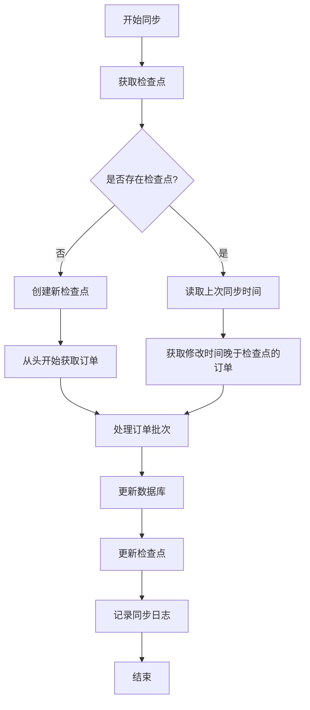

# 增量同步逻辑说明

## 概述
增量同步是一种高效的数据同步策略，只同步自上次同步以来发生变化的数据，而不是每次都同步全部数据。

## 核心概念

### 1. 同步检查点（Sync Checkpoints）
存储在 `sync_checkpoints_v2` 表中，记录每个站点的同步状态：
- `last_order_id`: 最后同步的订单ID
- `last_order_modified`: 最后同步的订单修改时间
- `last_product_id`: 最后同步的产品ID
- `last_product_modified`: 最后同步的产品修改时间
- `orders_synced_count`: 已同步的订单总数
- `products_synced_count`: 已同步的产品总数

### 2. 同步模式
- **增量同步（incremental）**: 只同步上次检查点之后修改的数据
- **全量同步（full）**: 同步所有数据，忽略检查点

## 订单增量同步逻辑

### 工作流程


### 关键代码逻辑

#### 1. 获取增量数据
```typescript
// 构建查询参数
if (mode === 'incremental' && checkpoint?.last_order_modified) {
  const lastModified = new Date(checkpoint.last_order_modified);
  // 添加1秒避免重复获取同一订单
  lastModified.setSeconds(lastModified.getSeconds() + 1);
  params.append('modified_after', lastModified.toISOString());
}
```

#### 2. 批量处理
```typescript
const batchSize = 50; // 可配置的批次大小
for (let i = 0; i < orders.length; i += batchSize) {
  const batch = orders.slice(i, i + batchSize);
  await processOrderBatch(supabase, siteId, batch, results);
  // 更新进度
}
```

#### 3. 更新检查点
```typescript
await supabase
  .from('sync_checkpoints_v2')
  .upsert({
    site_id: siteId,
    sync_type: 'orders',
    last_order_id: lastOrder.id,
    last_order_modified: lastOrder.date_modified,
    orders_synced_count: checkpoint.orders_synced_count + results.syncedOrders,
    last_sync_completed_at: new Date().toISOString(),
  });
```

## 产品增量同步逻辑

### 特点
1. **支持变体产品**: 同步主产品及其所有变体
2. **库存状态同步**: 实时更新产品库存状态
3. **分类映射**: 同步产品分类信息

### 处理流程
1. 获取修改过的产品列表
2. 对于每个产品：
   - 同步主产品信息
   - 如果是变体产品，同步所有变体
   - 更新库存状态
   - 更新分类映射

## 优化策略

### 1. 防重复机制
```typescript
const seenOrderIds = new Set<number>();
// 检查是否已经处理过
if (seenOrderIds.has(order.id)) {
  continue;
}
seenOrderIds.add(order.id);
```

### 2. 批处理优化
- 默认批次大小：50条记录
- 可根据服务器性能调整
- 每10个批次记录一次进度

### 3. 错误恢复
- 记录失败的记录
- 保存错误详情
- 支持从失败点恢复

### 4. 性能监控
```typescript
const startTime = Date.now();
// ... 同步逻辑
const duration = Date.now() - startTime;
// 记录耗时
```

## 同步触发方式

### 1. 手动触发
通过管理界面点击"同步"按钮

### 2. 定时任务
```typescript
// 每小时执行一次增量同步
schedule: '0 * * * *'
```

### 3. Webhook触发
当WooCommerce有数据变更时，通过Webhook实时触发同步

## 数据完整性保证

### 1. 事务处理
使用数据库事务确保数据一致性：
```typescript
await supabase.rpc('begin_transaction');
try {
  // 批量插入/更新
  await supabase.rpc('commit_transaction');
} catch (error) {
  await supabase.rpc('rollback_transaction');
}
```

### 2. 幂等性设计
- 使用 `upsert` 操作，重复同步不会产生重复数据
- 基于唯一键（如订单号、SKU）进行更新

### 3. 数据验证
- 检查必填字段
- 验证数据格式
- 处理异常数据

## 监控和日志

### 同步日志表 (`sync_logs`)
记录每次同步的详细信息：
- 同步类型和模式
- 开始/结束时间
- 成功/失败数量
- 错误信息

### 实时进度更新
```typescript
await supabase
  .from('sync_logs')
  .update({
    status: 'in_progress',
    items_synced: results.syncedOrders,
    progress_percentage: Math.round((results.syncedOrders / total) * 100),
  });
```

## 常见问题处理

### 1. 超时问题
- 设置请求超时：30秒
- 大批量数据分页处理
- 使用异步任务队列

### 2. 内存溢出
- 流式处理大数据
- 及时释放内存
- 控制批次大小

### 3. API限流
- 实现退避重试机制
- 控制并发请求数
- 缓存频繁访问的数据

## 最佳实践

1. **定期全量同步**: 建议每周进行一次全量同步，确保数据完整性
2. **监控同步状态**: 设置告警，及时发现同步异常
3. **备份检查点**: 定期备份检查点数据，便于恢复
4. **优化查询**: 为常用查询字段建立索引
5. **清理历史数据**: 定期清理过期的同步日志