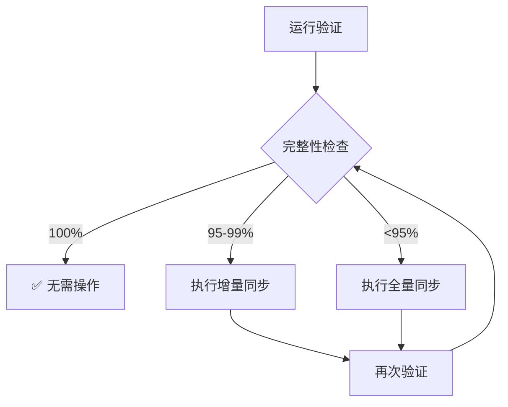

# 数据完整性验证指南

## 概述
确保全量同步结果完整无遗漏的验证方法和工具。

## 验证工具

### 1. 内置验证功能
点击站点管理中的 **验证按钮** (✓图标) 可以：

- **实时对比**: 对比 WooCommerce 和数据库中的数据总量
- **完整性百分比**: 显示同步完成度
- **缺失数据检测**: 抽样检查缺失的订单和产品
- **智能建议**: 根据验证结果提供操作建议

### 2. 验证内容

#### 订单验证
- ✅ 订单总数对比
- ✅ 各状态订单数量
- ✅ 时间范围覆盖
- ✅ 抽样订单存在性检查

#### 产品验证
- ✅ 产品总数对比
- ✅ 变体产品数量
- ✅ 产品类型分布
- ✅ 随机产品抽样

#### 同步历史
- ✅ 最后同步时间
- ✅ 同步任务状态
- ✅ 错误日志记录

## 验证方法

### 方法一：使用内置验证器

1. **打开站点管理**
2. **点击验证按钮** (✓)
3. **查看验证报告**
   - 绿色 = 100% 完整
   - 黄色 = 95-99% 完整
   - 橙色 = 80-94% 完整
   - 红色 = <80% 完整

### 方法二：手动验证 SQL

```sql
-- 1. 检查订单总数
SELECT 
  site_id,
  COUNT(*) as total_orders,
  MIN(date_created) as earliest_order,
  MAX(date_created) as latest_order
FROM orders
WHERE site_id = 'YOUR_SITE_ID'
GROUP BY site_id;

-- 2. 检查订单状态分布
SELECT 
  status,
  COUNT(*) as count
FROM orders
WHERE site_id = 'YOUR_SITE_ID'
GROUP BY status
ORDER BY count DESC;

-- 3. 检查产品总数
SELECT 
  site_id,
  COUNT(DISTINCT product_id) as total_products,
  COUNT(DISTINCT CASE WHEN type = 'variable' THEN product_id END) as variable_products,
  COUNT(DISTINCT CASE WHEN type = 'simple' THEN product_id END) as simple_products
FROM products
WHERE site_id = 'YOUR_SITE_ID'
GROUP BY site_id;

-- 4. 检查订单项完整性
SELECT 
  o.order_id,
  o.order_number,
  COUNT(oi.item_id) as item_count
FROM orders o
LEFT JOIN order_items oi ON o.id = oi.order_id
WHERE o.site_id = 'YOUR_SITE_ID'
GROUP BY o.order_id, o.order_number
HAVING COUNT(oi.item_id) = 0;

-- 5. 检查同步日志
SELECT 
  sync_type,
  sync_mode,
  status,
  items_to_sync,
  items_synced,
  items_failed,
  created_at,
  duration_ms
FROM sync_logs
WHERE site_id = 'YOUR_SITE_ID'
ORDER BY created_at DESC
LIMIT 10;
```

### 方法三：API 验证

使用验证 API 端点：

```javascript
// 调用验证 API
const response = await fetch('/api/sync/verify', {
  method: 'POST',
  headers: { 'Content-Type': 'application/json' },
  body: JSON.stringify({ siteId: 'your-site-id' })
});

const result = await response.json();
console.log(result.verification);
```

## 验证结果解读

### 完整性指标

| 完整性 | 状态 | 说明 | 建议操作 |
|--------|------|------|----------|
| 100% | ✅ 完整 | 所有数据已同步 | 无需操作 |
| 95-99% | ⚠️ 基本完整 | 少量数据缺失 | 执行增量同步 |
| 80-94% | ⚠️ 不完整 | 部分数据缺失 | 执行全量同步 |
| <80% | ❌ 严重不完整 | 大量数据缺失 | 检查配置并全量同步 |

### 常见问题原因

1. **订单数量不匹配**
   - API 权限限制
   - 同步过程中断
   - 时区差异导致的日期过滤问题
   - 订单状态过滤

2. **产品数量不匹配**
   - 隐藏产品未同步
   - 变体产品计数差异
   - 产品类型过滤

3. **缺失数据**
   - 网络超时
   - API 限流
   - 数据库写入失败

## 确保完整性的最佳实践

### 1. 同步前准备
- ✅ 确认 API 密钥有完整权限
- ✅ 检查网络连接稳定性
- ✅ 确保数据库有足够空间

### 2. 同步时监控
- ✅ 查看实时进度
- ✅ 监控错误日志
- ✅ 检查任务状态

### 3. 同步后验证
- ✅ 立即运行验证检查
- ✅ 对比关键指标
- ✅ 抽样检查数据

### 4. 定期维护
- ✅ 每周执行增量同步
- ✅ 每月执行全量同步
- ✅ 每月运行完整性验证

## 问题修复流程



## 高级验证选项

### 1. 深度验证
检查每个订单的详细信息：
- 订单项数量
- 客户信息完整性
- 金额准确性

### 2. 时间范围验证
验证特定时间段的数据：
- 最近30天
- 特定月份
- 自定义范围

### 3. 关键数据验证
重点检查：
- 高价值订单
- VIP客户订单
- 热销产品

## 自动化验证

### 定时验证任务
可以设置定时任务自动验证：

```javascript
// 每天凌晨3点自动验证
schedule.scheduleJob('0 3 * * *', async () => {
  const sites = await getAllSites();
  for (const site of sites) {
    await verifySync(site.id);
  }
});
```

## 验证报告导出

验证结果可以导出为：
- JSON 格式（程序化处理）
- CSV 格式（Excel 分析）
- PDF 报告（管理层汇报）

## 总结

通过以上验证方法，您可以：

1. **实时了解** 同步完整性状态
2. **快速定位** 数据缺失问题
3. **智能获取** 修复建议
4. **持续监控** 数据质量

确保您的 WooCommerce 数据始终完整、准确、可靠。